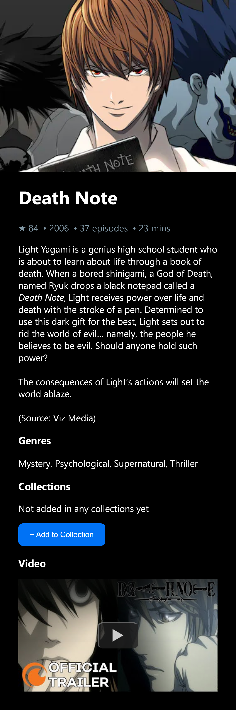
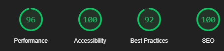

# Anime Collections
Web App to browse anime from anilist api and save it to your collections.
[Demo URL](https://anime-collections-six.vercel.app/)

<br>
<center>
  
</center>
<br>

## Features
- Explore thousands of anime from anilist api
- View anime detail like rating, description, video, etc
- Save favorite anime to your collection
- Edit saved collection or remove them

## Tech Stack
- NextJs
- Apollo GraphQL
- Emotion CSS
- Jest
- React Testing Library

## Run Locally

Clone the project

```bash
  git clone https://github.com/aurisz/anime-collections
```

Go to the project directory

```bash
  cd anime-collections
```

Install dependencies

```bash
  npm install
```

Start the app

```bash
  npm run dev
```

Open [http://localhost:3000](http://localhost:3000) with your browser to see the result.

## Screenshots


&nbsp;&nbsp;&nbsp;


### Lighthouse Report
